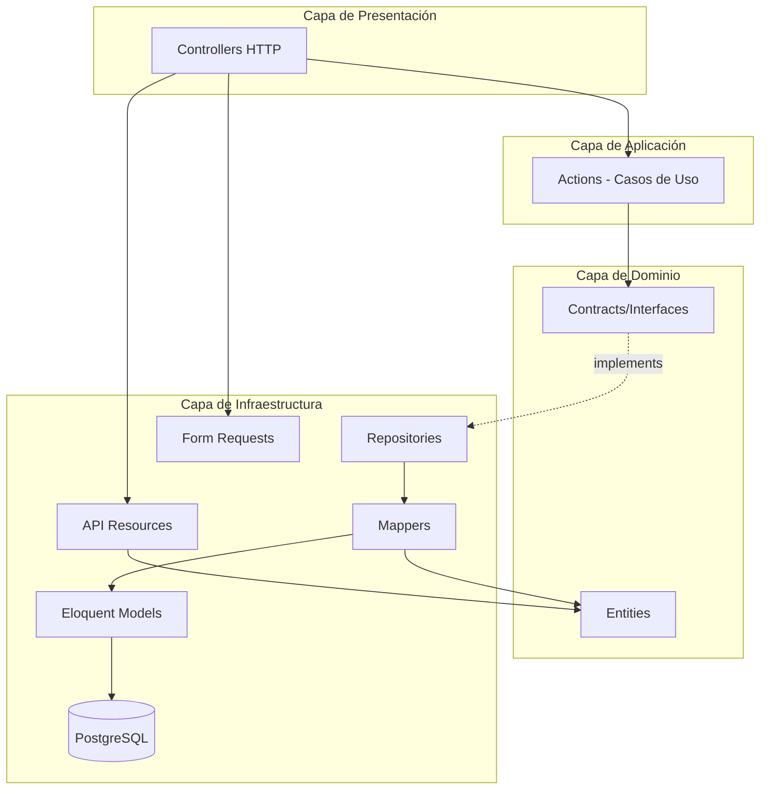
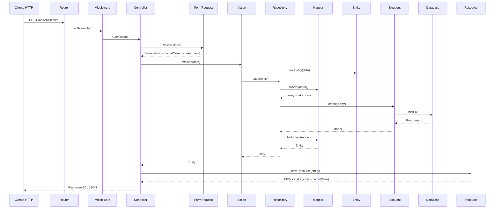
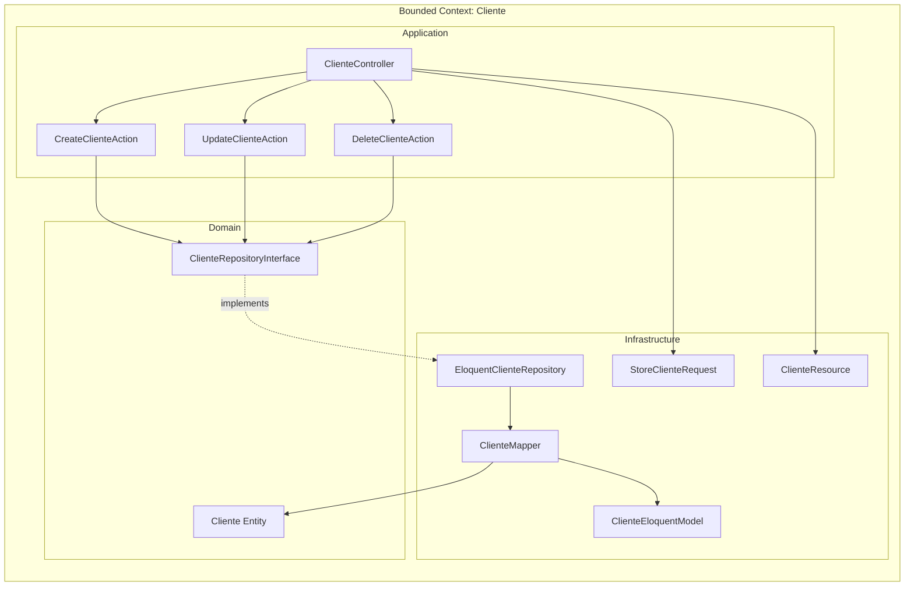
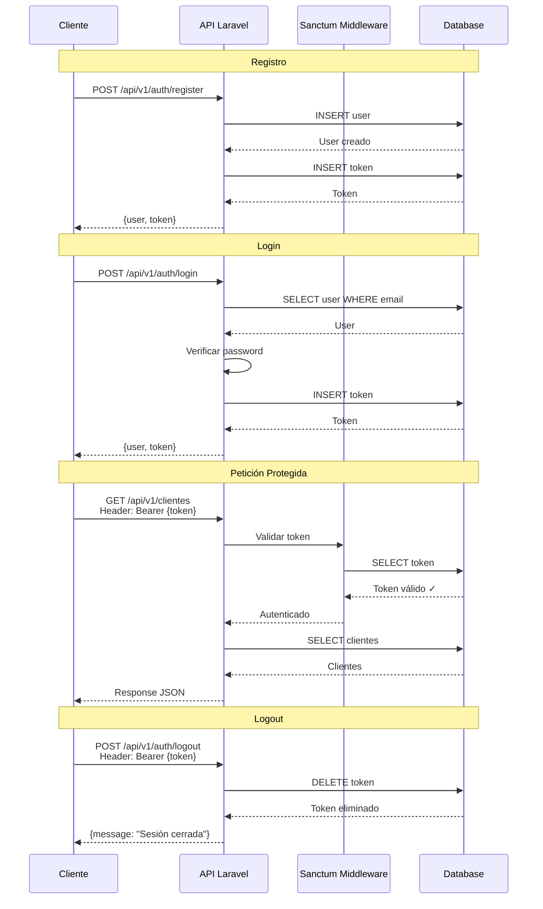
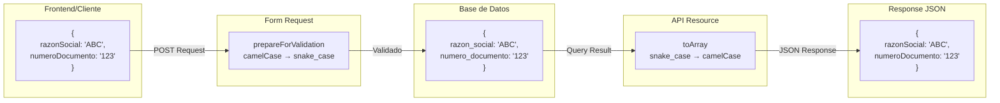

# API REST Base - Proyecto Base 

Este es un proyecto base de Laravel con arquitectura **DDD (Domain-Driven Design)** configurado solo con el módulo de **Autenticación (Auth)** usando **Laravel Sanctum**.

## 🎯 Propósito

Este proyecto sirve como base para enseñar arquitectura DDD en Laravel. Los estudiantes aprenderán a:
- Implementar arquitectura DDD con separación en capas
- Crear nuevos Bounded Contexts (módulos)
- Implementar autenticación con Sanctum
- Desarrollar APIs RESTful
- Integrar frontend Vue 3 con Inertia.js

## 📋 Requisitos Previos

- PHP >= 8.2
- Composer
- Node.js >= 18
- PostgreSQL >= 14
- Git

## 🚀 Instalación

### Opción 1: Usar este Proyecto Base (Recomendado para Estudiantes)

#### 1. Clonar el repositorio

```bash
git clone <url-del-repositorio>
cd api-rest-base
```

#### 2. Instalar dependencias de PHP

```bash
composer install
```

#### 3. Instalar dependencias de Node.js

```bash
npm install
```

#### 4. Configurar variables de entorno

```bash
cp .env.example .env
```

Edita el archivo `.env` y configura tu base de datos:

```env
DB_CONNECTION=pgsql
DB_HOST=127.0.0.1
DB_PORT=5432
DB_DATABASE=api_rest_base
DB_USERNAME=postgres
DB_PASSWORD=tu_password
```

### 5. Generar clave de aplicación

```bash
php artisan key:generate
```

#### 5. Generar clave de aplicación

```bash
php artisan key:generate
```

#### 6. Crear base de datos

Crea la base de datos en PostgreSQL:

```sql
CREATE DATABASE api_rest_base;
```

O desde la terminal:

```bash
createdb api_rest_base
```

#### 7. Ejecutar migraciones

```bash
php artisan migrate
```

#### 8. Compilar assets

**Desarrollo (con hot reload):**
```bash
npm run dev
```

En otra terminal, inicia el servidor de Laravel:

```bash
php artisan serve
```

**Producción:**
```bash
npm run build
php artisan serve
```

La aplicación estará disponible en: `http://localhost:8000`

---

### Opción 2: Crear Proyecto desde Cero (Para Aprender el Setup Completo)

Si quieres aprender a configurar Laravel con DDD y Sanctum desde cero, sigue estos pasos:

#### 1. Instalar Laravel

```bash
composer create-project laravel/laravel api-rest-base
cd api-rest-base
```

#### 2. Configurar Base de Datos

Edita `.env`:

```env
DB_CONNECTION=pgsql
DB_HOST=127.0.0.1
DB_PORT=5432
DB_DATABASE=api_rest_base
DB_USERNAME=postgres
DB_PASSWORD=tu_password
```

Crear la base de datos:

```bash
createdb api_rest_base
```

#### 3. Instalar Laravel Sanctum

```bash
composer require laravel/sanctum
```

#### 4. Publicar configuración de Sanctum

```bash
php artisan vendor:publish --provider="Laravel\Sanctum\SanctumServiceProvider"
```

Esto crea:
- `config/sanctum.php` - Configuración de Sanctum
- Migración de `personal_access_tokens`

#### 5. Ejecutar migraciones

```bash
php artisan migrate
```

#### 6. Configurar Sanctum en el modelo User

Edita `app/Models/User.php`:

```php
use Laravel\Sanctum\HasApiTokens;

class User extends Authenticatable
{
    use HasApiTokens, HasFactory, Notifiable;

    // ...
}
```

#### 7. Configurar middleware de Sanctum

Edita `bootstrap/app.php`:

```php
->withMiddleware(function (Middleware $middleware) {
    $middleware->api(prepend: [
        \Laravel\Sanctum\Http\Middleware\EnsureFrontendRequestsAreStateful::class,
    ]);
})
```

#### 8. Configurar CORS para Sanctum

Edita `config/sanctum.php`:

```php
'stateful' => explode(',', env('SANCTUM_STATEFUL_DOMAINS', sprintf(
    '%s%s',
    'localhost,localhost:3000,127.0.0.1,127.0.0.1:8000,::1',
    Sanctum::currentApplicationUrlWithPort()
))),
```

#### 9. Instalar Inertia.js

**Backend:**
```bash
composer require inertiajs/inertia-laravel
```

Publicar middleware:

```bash
php artisan inertia:middleware
```

Agregar middleware en `bootstrap/app.php`:

```php
->withMiddleware(function (Middleware $middleware) {
    $middleware->web(append: [
        \App\Http\Middleware\HandleInertiaRequests::class,
    ]);
})
```

**Frontend:**
```bash
npm install @inertiajs/vue3
npm install vue @vitejs/plugin-vue
```

#### 10. Configurar Vite

Edita `vite.config.js`:

```javascript
import { defineConfig } from 'vite';
import laravel from 'laravel-vite-plugin';
import vue from '@vitejs/plugin-vue';

export default defineConfig({
    plugins: [
        laravel({
            input: ['resources/css/app.css', 'resources/js/app.js'],
            refresh: true,
        }),
        vue({
            template: {
                transformAssetUrls: {
                    base: null,
                    includeAbsolute: false,
                },
            },
        }),
    ],
});
```

#### 11. Crear estructura DDD

```bash
mkdir -p src/Auth/{Domain/{Contracts,Entities},Application/{Actions,Controllers},Infrastructure/{Models,Repositories,Mappers,Requests,Resources,Migrations}}
```

#### 12. Crear BoundedContextServiceProvider

```bash
php artisan make:provider BoundedContextServiceProvider
```

Implementar la lógica de carga de contextos (ver código en el proyecto).

#### 13. Registrar provider

Edita `bootstrap/app.php`:

```php
->withProviders([
    \App\Providers\BoundedContextServiceProvider::class,
])
```

#### 14. Crear Trait HasUuid

```bash
mkdir app/Traits
```

Crear `app/Traits/HasUuid.php`:

```php
<?php

namespace App\Traits;

use Illuminate\Support\Str;

trait HasUuid
{
    protected static function bootHasUuid()
    {
        static::creating(function ($model) {
            if (empty($model->{$model->getKeyName()})) {
                $model->{$model->getKeyName()} = (string) Str::uuid();
            }
        });
    }

    public function getIncrementing()
    {
        return false;
    }

    public function getKeyType()
    {
        return 'string';
    }
}
```

#### 15. Instalar dependencias de UI

```bash
npm install @nuxt/ui @tanstack/table-core
npm install @vueuse/core
npm install ziggy-js
```

#### 16. Compilar y ejecutar

```bash
npm run dev
```

En otra terminal:

```bash
php artisan serve
```

---

## 🔧 Levantar el Proyecto (Uso Diario)

Una vez instalado, para trabajar cada día:

### 1. Iniciar base de datos (si no está corriendo)

**PostgreSQL en Mac/Linux:**
```bash
brew services start postgresql@14
# o
sudo systemctl start postgresql
```

**PostgreSQL en Windows:**
```bash
# Usar pgAdmin o servicios de Windows
```

### 2. Iniciar servidor de desarrollo frontend

En una terminal:

```bash
npm run dev
```

Esto iniciará Vite con hot reload en `http://localhost:5173`

### 3. Iniciar servidor de Laravel

En otra terminal:

```bash
php artisan serve
```

Esto iniciará Laravel en `http://localhost:8000`

### 4. Acceder a la aplicación

Abre tu navegador en: `http://localhost:8000`

### Comandos útiles:

```bash
# Limpiar caché
php artisan cache:clear
php artisan config:clear
php artisan route:clear

# Ver rutas
php artisan route:list

# Ejecutar migraciones
php artisan migrate

# Rollback de migraciones
php artisan migrate:rollback

# Refrescar base de datos (CUIDADO: borra datos)
php artisan migrate:fresh

# Ver logs en tiempo real
tail -f storage/logs/laravel.log
```

## 📁 Estructura del Proyecto

```
api-rest-base/
├── app/
│   ├── Http/
│   │   ├── Controllers/        # Controladores generales (Dashboard)
│   │   └── Middleware/         # Middleware personalizado
│   ├── Models/                 # Modelos Eloquent base (User)
│   └── Providers/
│       └── BoundedContextServiceProvider.php  # Registro de contextos
│
├── src/                        # Bounded Contexts (DDD)
│   └── Auth/                   # Módulo de Autenticación
│       ├── Domain/            # Capa de Dominio
│       │   ├── Contracts/     # Interfaces (Repository)
│       │   └── Entities/      # Entidades del dominio
│       ├── Application/       # Capa de Aplicación
│       │   ├── Actions/       # Casos de uso
│       │   └── Controllers/   # Controladores HTTP
│       └── Infrastructure/    # Capa de Infraestructura
│           ├── Models/        # Modelos Eloquent
│           ├── Repositories/  # Implementación de repositorios
│           ├── Mappers/       # Conversión Entity ↔ Eloquent
│           ├── Requests/      # Validación (Form Requests)
│           ├── Resources/     # Transformación JSON (API Resources)
│           └── Migrations/    # Migraciones de BD
│
├── resources/
│   ├── js/
│   │   ├── Pages/
│   │   │   ├── Auth/          # Páginas de autenticación
│   │   │   └── Dashboard.vue  # Dashboard principal
│   │   ├── components/        # Componentes Vue reutilizables
│   │   ├── composables/       # Composables de Vue
│   │   └── layouts/           # Layouts de la aplicación
│   └── views/
│       └── app.blade.php      # Template principal de Inertia
│
├── routes/
│   ├── api.php                # Rutas API generales
│   └── web.php                # Rutas web generales
│
├── database/
│   └── migrations/            # Migraciones base de Laravel
│
├── config/                    # Archivos de configuración
├── bootstrap/
│   └── app.php               # Configuración de la aplicación
│
└── DOCUMENTATION.md          # Documentación completa de la arquitectura
```

## 🏗️ Arquitectura DDD

El proyecto implementa **Domain-Driven Design** con 3 capas bien definidas:

### Diagrama de Arquitectura en Capas



### Flujo de una Petición HTTP



### Estructura de un Bounded Context



### 1. Domain (Dominio)
- **Entities**: Representan conceptos del negocio
  - Ejemplo: `Cliente`, `Producto`, `Factura`
  - Contienen lógica de negocio
  - Inmutables (se modifican con métodos específicos)

- **Contracts**: Interfaces que definen contratos (Repository Interfaces)
  - Ejemplo: `ClienteRepositoryInterface`
  - Definen métodos sin implementación
  - Permiten inversión de dependencias

- **Lógica de negocio pura**, sin dependencias de frameworks

### 2. Application (Aplicación)
- **Actions**: Casos de uso del sistema
  - Ejemplo: `CreateUserAction`, `LoginAction`, `CreateClienteAction`
  - Una clase = un caso de uso
  - Orquestan entre dominio e infraestructura

- **Controllers**: Manejan peticiones HTTP
  - Ejemplo: `ClienteController`, `AuthController`
  - Validan con Form Requests
  - Retornan API Resources

### 3. Infrastructure (Infraestructura)
- **Models**: Modelos Eloquent (acceso a BD)
  - Ejemplo: `ClienteEloquentModel`, `UserEloquentModel`
  - Mapean tablas a objetos PHP
  - Definen relaciones

- **Repositories**: Implementación de los contratos del dominio
  - Ejemplo: `EloquentClienteRepository`
  - Implementan interfaces del dominio
  - Usan Mappers para conversión

- **Mappers**: Convierten entre Eloquent Models y Domain Entities
  - Ejemplo: `ClienteMapper`
  - `toDomain()`: Model → Entity
  - `toArray()`: Entity → Array

- **Requests**: Validación de datos de entrada
  - Ejemplo: `StoreClienteRequest`, `LoginRequest`
  - Validan campos requeridos
  - Convierten camelCase → snake_case

- **Resources**: Transformación de datos para respuestas JSON
  - Ejemplo: `ClienteResource`, `UserResource`
  - Formatean respuestas
  - Convierten snake_case → camelCase

- **Migrations**: Definición del esquema de base de datos

### Diagrama de Autenticación con Sanctum



### Conversión de Datos (camelCase ↔ snake_case)



## 🔐 Autenticación con Sanctum

El proyecto incluye autenticación completa usando **Laravel Sanctum**:

### Rutas API

- `POST /api/v1/auth/register` - Registrar usuario
- `POST /api/v1/auth/login` - Iniciar sesión (retorna token)
- `POST /api/v1/auth/logout` - Cerrar sesión (requiere auth)
- `GET /api/v1/auth/me` - Obtener usuario autenticado (requiere auth)

### Rutas Web

- `GET /login` - Formulario de login
- `POST /login` - Procesar login
- `GET /register` - Formulario de registro
- `POST /register` - Procesar registro
- `POST /logout` - Cerrar sesión
- `GET /dashboard` - Dashboard (requiere auth)

### Ejemplo de uso API

```bash
# Registrar usuario
curl -X POST http://localhost:8000/api/v1/auth/register \
  -H "Content-Type: application/json" \
  -d '{
    "name": "Juan Pérez",
    "email": "juan@example.com",
    "password": "password123",
    "passwordConfirmation": "password123"
  }'

# Login
curl -X POST http://localhost:8000/api/v1/auth/login \
  -H "Content-Type: application/json" \
  -d '{
    "email": "juan@example.com",
    "password": "password123"
  }'

# Respuesta incluye token:
# {
#   "user": {...},
#   "token": "1|abc123..."
# }

# Usar token en peticiones protegidas
curl -X GET http://localhost:8000/api/v1/auth/me \
  -H "Authorization: Bearer 1|abc123..."
```

## 📚 Cómo Agregar un Nuevo Bounded Context

Para que los estudiantes aprendan a crear nuevos módulos, sigue estos pasos:

### 1. Crear la estructura de carpetas

```bash
mkdir -p src/NuevoContexto/{Domain/{Contracts,Entities},Application/{Actions,Controllers},Infrastructure/{Models,Repositories,Mappers,Requests,Resources,Migrations}}
```

### 2. Crear la Entity (Domain)

```php
// src/NuevoContexto/Domain/Entities/MiEntidad.php
namespace Src\NuevoContexto\Domain\Entities;

class MiEntidad
{
    public function __construct(
        private string $id,
        private string $nombre,
        // ...
    ) {}

    public function getId(): string
    {
        return $this->id;
    }

    // Getters y métodos de negocio...
}
```

### 3. Crear el Contract (Domain)

```php
// src/NuevoContexto/Domain/Contracts/MiEntidadRepositoryInterface.php
namespace Src\NuevoContexto\Domain\Contracts;

interface MiEntidadRepositoryInterface
{
    public function findAll(): Collection;
    public function findById(string $id): ?MiEntidad;
    public function save(MiEntidad $entidad): MiEntidad;
}
```

### 4. Crear el Modelo Eloquent (Infrastructure)

```php
// src/NuevoContexto/Infrastructure/Models/MiEntidadEloquentModel.php
namespace Src\NuevoContexto\Infrastructure\Models;

use Illuminate\Database\Eloquent\Model;
use App\Traits\HasUuid;

class MiEntidadEloquentModel extends Model
{
    use HasUuid;

    protected $table = 'mi_tabla';

    protected $fillable = ['id', 'nombre', ...];
}
```

### 5. Crear el Repository (Infrastructure)

```php
// src/NuevoContexto/Infrastructure/Repositories/EloquentMiEntidadRepository.php
namespace Src\NuevoContexto\Infrastructure\Repositories;

class EloquentMiEntidadRepository implements MiEntidadRepositoryInterface
{
    public function findAll(): Collection
    {
        return MiEntidadEloquentModel::all()
            ->map(fn($model) => MiEntidadMapper::toDomain($model));
    }
}
```

### 6. Crear el Mapper (Infrastructure)

```php
// src/NuevoContexto/Infrastructure/Mappers/MiEntidadMapper.php
namespace Src\NuevoContexto\Infrastructure\Mappers;

class MiEntidadMapper
{
    public static function toDomain(MiEntidadEloquentModel $model): MiEntidad
    {
        return new MiEntidad(
            id: $model->id,
            nombre: $model->nombre,
        );
    }
}
```

### 7. Crear Actions (Application)

```php
// src/NuevoContexto/Application/Actions/CreateMiEntidadAction.php
namespace Src\NuevoContexto\Application\Actions;

class CreateMiEntidadAction
{
    public function __construct(
        private MiEntidadRepositoryInterface $repository
    ) {}

    public function execute(array $data): MiEntidad
    {
        $entidad = new MiEntidad(...$data);
        return $this->repository->save($entidad);
    }
}
```

### 8. Crear Controller (Application)

```php
// src/NuevoContexto/Application/Controllers/MiEntidadController.php
namespace Src\NuevoContexto\Application\Controllers;

class MiEntidadController extends Controller
{
    public function __construct(
        private CreateMiEntidadAction $createAction
    ) {}

    public function store(StoreMiEntidadRequest $request)
    {
        $entidad = $this->createAction->execute($request->validated());
        return new MiEntidadResource($entidad);
    }
}
```

### 9. Crear Request (Infrastructure)

```php
// src/NuevoContexto/Infrastructure/Requests/StoreMiEntidadRequest.php
namespace Src\NuevoContexto\Infrastructure\Requests;

class StoreMiEntidadRequest extends FormRequest
{
    public function rules(): array
    {
        return [
            'nombre' => 'required|max:255',
        ];
    }
}
```

### 10. Crear Resource (Infrastructure)

```php
// src/NuevoContexto/Infrastructure/Resources/MiEntidadResource.php
namespace Src\NuevoContexto\Infrastructure\Resources;

class MiEntidadResource extends JsonResource
{
    public function toArray($request): array
    {
        return [
            'id' => $this->id,
            'nombre' => $this->nombre,
        ];
    }
}
```

### 11. Crear rutas

```php
// src/NuevoContexto/api.php
use Illuminate\Support\Facades\Route;
use Src\NuevoContexto\Application\Controllers\MiEntidadController;

Route::middleware('auth:sanctum')->group(function () {
    Route::apiResource('mi-entidades', MiEntidadController::class);
});
```

### 12. Registrar en BoundedContextServiceProvider

```php
// app/Providers/BoundedContextServiceProvider.php

// En register():
$this->app->bind(
    MiEntidadRepositoryInterface::class,
    EloquentMiEntidadRepository::class
);

// En loadBoundedContextRoutes() y loadBoundedContextMigrations():
$boundedContexts = [
    'Auth',
    'NuevoContexto',  // Agregar aquí
];
```

### 13. Crear migración

```php
// src/NuevoContexto/Infrastructure/Migrations/2026_01_04_create_mi_tabla_table.php
use Illuminate\Database\Migrations\Migration;

return new class extends Migration
{
    public function up(): void
    {
        Schema::create('mi_tabla', function (Blueprint $table) {
            $table->uuid('id')->primary();
            $table->string('nombre');
            $table->timestamps();
        });
    }
};
```

### 14. Ejecutar migración

```bash
php artisan migrate
```

## 🧪 Testing

```bash
# Ejecutar tests
php artisan test

# Con coverage
php artisan test --coverage
```

## 📖 Documentación Completa

Para ver la documentación completa de la arquitectura DDD, conceptos clave y ejemplos de API, consulta:

**[DOCUMENTATION.md](DOCUMENTATION.md)**

## 🎓 Ejercicios Propuestos para Estudiantes

1. **Módulo Cliente**
   - Crear CRUD completo de clientes
   - Campos: tipo_documento, numero_documento, razon_social, direccion, telefono, email

2. **Módulo Producto**
   - Crear CRUD de productos
   - Relación con Categoría
   - Campos: codigo, nombre, descripcion, precio_unitario, stock

3. **Módulo Factura**
   - Crear facturas con detalles
   - Relaciones con Cliente, Usuario y Producto
   - Calcular totales automáticamente

## 🔧 Tecnologías Utilizadas

### Backend
- **Laravel 11** - Framework PHP
- **PostgreSQL** - Base de datos
- **Laravel Sanctum** - Autenticación API
- **Inertia.js** - Comunicación Laravel ↔ Vue

### Frontend
- **Vue 3** - Framework JavaScript
- **TypeScript** - Tipado estático
- **Nuxt UI** - Componentes UI
- **TanStack Table** - Tablas avanzadas
- **Vite** - Build tool

## 📝 Notas Importantes

1. **UUIDs**: Todas las tablas usan UUIDs en lugar de IDs incrementales
2. **camelCase ↔ snake_case**: La API acepta camelCase y la BD usa snake_case
3. **Validación**: Siempre usar Form Requests para validar datos
4. **Recursos**: Usar API Resources para formatear respuestas JSON
5. **Mappers**: Nunca exponer modelos Eloquent directamente al dominio

## 🤝 Contribuciones

Este es un proyecto educativo. Los estudiantes pueden:
- Reportar bugs
- Sugerir mejoras
- Compartir sus implementaciones de nuevos módulos

## 📄 Licencia

Este proyecto es de código abierto para fines educativos.

---

**¡Feliz aprendizaje!** 🚀
